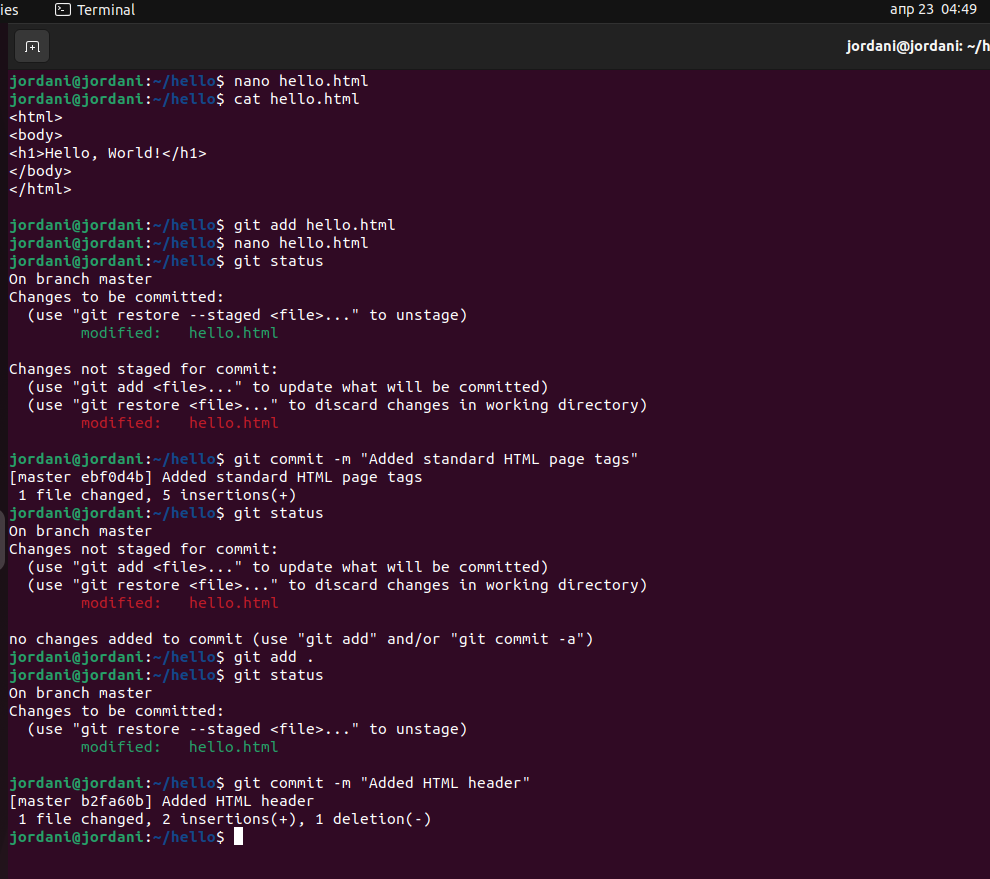
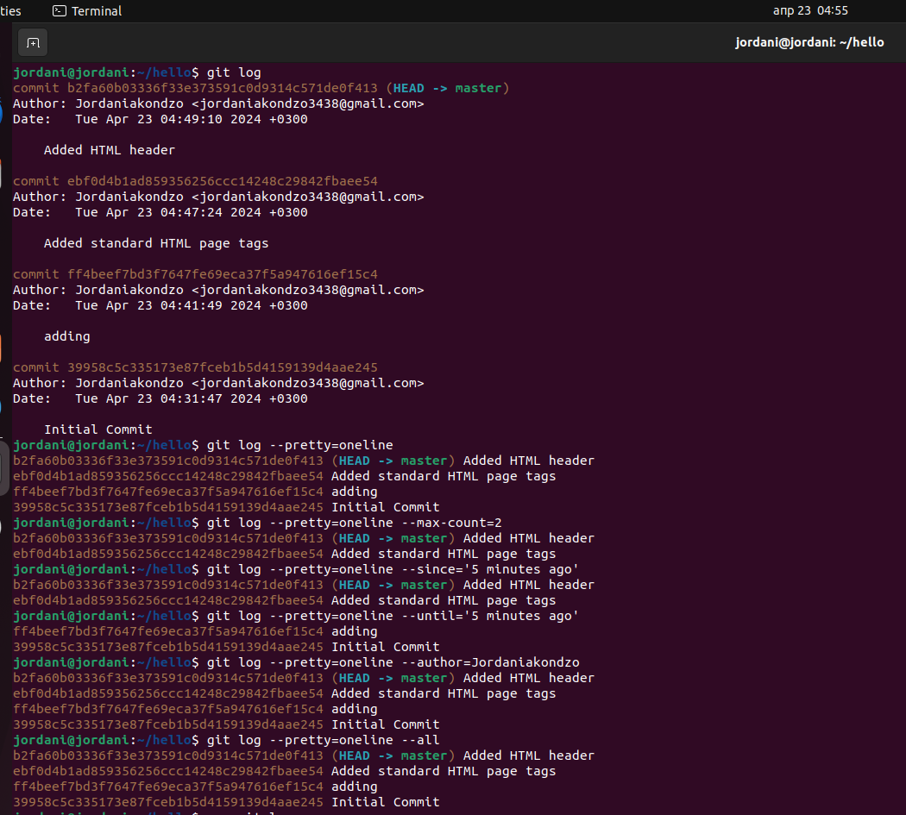
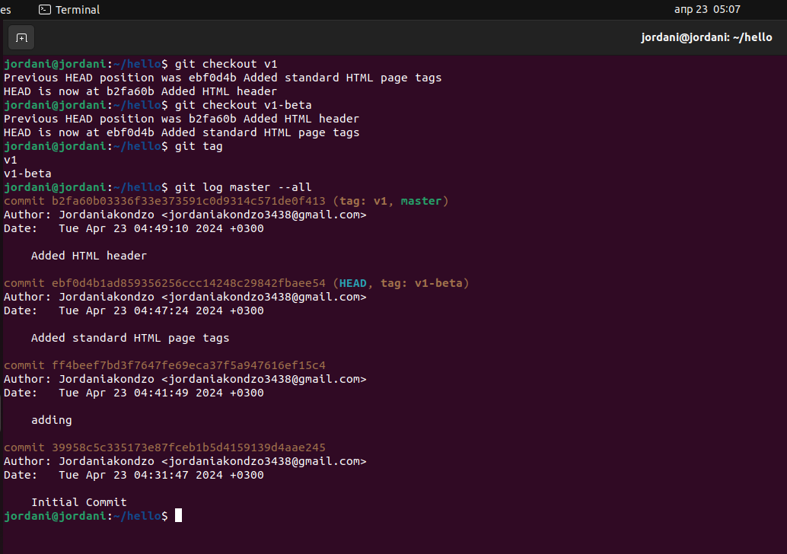
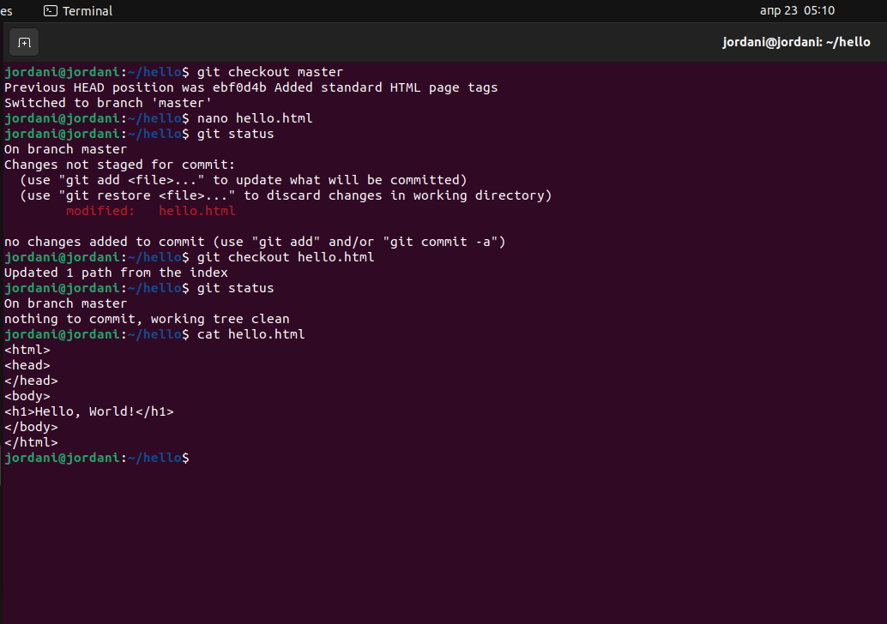

---
## Front matter
title: "Лабораторная работа №1"
subtitle: "Работа с git"
author: "Акондзо Жордани Лади Гаэл"

## Generic otions
lang: ru-RU
toc-title: "Содержание"

## Bibliography
bibliography: bib/cite.bib
csl: pandoc/csl/gost-r-7-0-5-2008-numeric.csl

## Pdf output format
toc: true # Table of contents
toc-depth: 2
lof: true # List of figures
lot: false # List of tables
fontsize: 12pt
linestretch: 1.5
papersize: a4
documentclass: scrreprt
## I18n polyglossia
polyglossia-lang:
  name: russian
  options:
	- spelling=modern
	- babelshorthands=true
polyglossia-otherlangs:
  name: english
## I18n babel
babel-lang: russian
babel-otherlangs: english
## Fonts
mainfont: PT Serif
romanfont: PT Serif
sansfont: PT Sans
monofont: PT Mono
mainfontoptions: Ligatures=TeX
romanfontoptions: Ligatures=TeX
sansfontoptions: Ligatures=TeX,Scale=MatchLowercase
monofontoptions: Scale=MatchLowercase,Scale=0.9
## Biblatex
biblatex: true
biblio-style: "gost-numeric"
biblatexoptions:
  - parentracker=true
  - backend=biber
  - hyperref=auto
  - language=auto
  - autolang=other*
  - citestyle=gost-numeric
## Pandoc-crossref LaTeX customization
figureTitle: "Рис."
tableTitle: "Таблица"
listingTitle: "Листинг"
lofTitle: "Список иллюстраций"
lotTitle: "Список таблиц"
lolTitle: "Листинги"
## Misc options
indent: true
header-includes:
  - \usepackage{indentfirst}
  - \usepackage{float} # keep figures where there are in the text
  - \floatplacement{figure}{H} # keep figures where there are in the text
---

# Цель работы

Приобретение практических навыков работы с ситемой управления версиями Git.

# Задание

Провести базовую настройку гит, создать проект и, используя его, изучить основные действия с репозиторием.

# Выполнение лабораторной работы

## Подготовка

Сначала настроим core.autocrlf с параметрами true и input, чтобы сделать все переводы строк текстовых файлов в главном репозитории одинаковыми, а затем настроим отображение unicode(рис. @fig:001).

{#fig:001 width=70%}

## Создание проекта

Создадим пустой каталог hello, а в нём файл с именем hello.html. Затем создадим  git репозиторий из этого каталога, выполнив команду git init. Добавим файл в репозиторий и проверим статус, который сообщает, что коммитить нечего(рис. @fig:002).

{#fig:002 width=70%}

## Внесение изменений

Изменим содержимое файла hello.html на:
```
<h1>Hello, World!</h1>

```

Проверив состояние рабочего каталога увидим, что git знает, что файл hello.html был изменен, но при этом эти изменения еще не зафиксированы в репозитории. Теперь проиндексируем изменения и снова посмотрим статус, в нём указано, что изменения пока не записаны в резапозиторий. И наконец закоммитим изменения, внеся их в репозиторий и снова посмотрим статус, который теперь показывает, что все изменения внесены в репозиторий (рис. @fig:003).

{#fig:003 width=70%}

Изменим страницу «Hello, World», чтобы она содержала стандартные теги <html>
и <body>.
```
<html>
  <body>
    <h1>Hello, World!</h1>
  </body>
</html>
```
Теперь добавим это изменение в индекс git и добавим заголовки HTML (секцию <head>) к странице «Hello, World». Проверив текущий статус увидим, что hello.html указан дважды в состоянии. Первое изменение (добавление стандартных тегов) проиндексировано и готово к коммиту. Второе изменение (добавление заголовков HTML) является непроиндексированным. Произведем коммит проиндексированного изменения, затем проиндексируем оставшееся изменение, посмотрим статус и прокоммитим его(рис. @fig:004).

{#fig:004 width=70%}

## История

Посмотрим список произведённыз изменений в станлартном виде, затем в однострочном, а также с указанием времени и количества(рис. @fig:005).

{#fig:005 width=70%}

## Получение старых версий

Изучим данные лога и найдем там хэш первого коммита, используя его вернемся к первой верссии и просмотрим файл hello.html, действительно, увидим первую версию. Затем вернемся к последней версии в ветке master и вновь посмотрим на файл(рис. @fig:006).

{#fig:006 width=70%}

## Создание тегов версий

Назовем текущую версию страницы hello первой (v1). Создадим тег первой версии и используем его для того чтобы венуться к предыдущей, которой также присвоим тег(рис. @fig:007).

{#fig:007 width=70%}

Переключимся по тегам между двумя отмеченными версиями. Просмотрим все доступные теги(их два) и посмотрим теки в логе(рис. @fig:008).

{#fig:008 width=70%}

## Отмена локальных изменений (до индексации)

Убдеимся, что мы находимся на последнем коммите ветки master и внесем изменение в файл hello.html в виде нежелательного комментария.  Затем проверим статус, увидим, что изменения ещё не проиндексированы. Используем команду git checkout для переключения версии файла hello.html в репозитории(рис. @fig:009).

{#fig:009 width=70%}

## Отмена проиндексированных изменений (перед коммитом)


Внесем изменение в файл hello.html в виде нежелательного комментария
```
<html>
  <head>
    <!-- This is an unwanted but staged comment -->
  </head>
  <body>
    <h1>Hello, World!</h1>
  </body>
</html>
```
Проиндексируем это изменение и проверим состояние. Состояние показывает, что изменение было проиндексировано и готово к коммиту. Используем команду git reset, чтобы сбросить буферную зону к HEAD. Это очищает буферную зону от изменений, которые мы только что проиндексировали. И переключимся на последнюю версию коммита, посмотрев статус увидим, что наш каталог опять чист(рис. @fig:010).

{#fig:010 width=70%}

## Отмена коммитов

Изменим файл hello.html на следующий.

```
<html>
  <head>
  </head>
  <body>
    <h1>Hello, World!</h1>
    <!-- This is an unwanted but committed change -->
  </body>
</html>
```
Проиндексируем изменения файла и прокоммитим их. Чтобы отменить коммит, нам необходимо сделать коммит, который удаляет изменения, сохраненные нежелательным коммитом. Перейдем в редактор, где изменим нежелательный коммит. Проверим лог. Проверка лога показывает нежелательные и отмененные коммиты в наш репозиторий(рис. @fig:011).

{#fig:011 width=70%}

## Удаление коммиттов из ветки

Удалим последние два коммита с помощью сброса, сначала отметим последний коммит тегом, чтобы его можно было потом найти. Используем команду git reset, чтобы вернуться к версии до этих коммитов. Теперь в логе их нет, но если посмотреть логи с опцией  --all можно всё ещё их увидеть, но метка HEAD находится на нужной нам версии(рис. @fig:012).

{#fig:012 width=70%}

## Удаление тега oops

Удалим тег oops и коммиты, на которые он ссылался, сборщиком мусора. Теперь этот тег не отображается в репозитории(рис. @fig:013).

{#fig:013 width=70%}

## Изменение предыдущего коммита

Добавим в страницу комментарий автора.
```
<!-- Author: Dmitry S. Kulyabov -->
<html>
  <head>
  </head>
  <body>
    <h1>Hello, World!</h1>
  </body>
</html>
```
Затем добавим их в репозиторий. Теперь мы хотим добавить в комментарий автора почту, обноим страницу hello, включив в неё почту. Чтобы у нас остался один коммит, а не два, изменим последний с помощьб опции --amend, теперь в логах отображается последняя версия коммита(рис. @fig:014).

{#fig:014 width=70%}

## Перемещение файлов

Переместим наш файл в каталог lib. Для этого создадим его и используем команду git mv, сделаем коммит этого пермещения(рис. @fig:015).

{#fig:015 width=70%}

## Подробнее о структуре

Добавим файл index.html в наш репозиторий
```
<html>
  <body>
    <iframe src="lib/hello.html" width="200" height="200" />
  </body>
</html>
```
Добавим файл и сделаем коммит(рис. @fig:016).

{#fig:016 width=70%}

Теперь при открытии index.html, увидим кусок страницы hello в маленьком окошке(рис. @fig:017).

{#fig:017 width=70%}

## Git внутри: Каталог .git

Просмотрим каталог, в котором хранится вся информация git. Затем посмотрим набор каталогов, имена которых состоят из 2 символов. Имена каталогов являются первыми двумя буквами хэша sha1 объекта, хранящегося в git. Посмотрим в один из каталогов с именем из 2 букв. Увидим файлы с именами из 38 символов. Это файлы, содержащие объекты, хранящиеся в git. Посмотрим файл конфигурации, создающийся для каждого конкретного проекта. Затем посмотрим подкаталоги .git/refs/heads и .git/refs/tags, а также содержимое файла v1, в нём хранится хэш коммита, привязанный к тегу. Также посмотрим содержимоей файла HEAD, который содержит ссылку на текущую ветку, в данный момент это ветка master(рис. @fig:018).

{#fig:018 width=70%}

## Работа непосредственно с объектами git

Найдем последний коммит и выедем его с помощью  SHA1 хэша. Затем посмотрим дерево каталогов, ссылка на который идёт в последнем коммите, вывдем каталог lib и файл  hello.html(рис. @fig:019).

{#fig:019 width=70%}

Исследуем  git репозиторий вручную самостоятельно. Используя хэш родительского коммита последовательно дойдем до первой версии файла hello.html и посмотрим его(рис. @fig:020).

{#fig:020 width=70%}

## Создание ветки

Создадим новую ветку «style» и перейдем в неё. Добавим туда файл стилей style.css и добавим его в репозиторий. Обновим файл hello.html, чтобы использовать стили style.css и index.html, также обавим их в репозиторий(рис. @fig:021).

{#fig:021 width=70%}

## Навигация по веткам

Посмотрим все логи(рис. @fig:022).

{#fig:022 width=70%}

Переключимся обратно на основную ветку и просмотрим содержимое файла ib/hello.html, заметим, что он не использует стили, также просмотрим содержимое этого файла в новой ветке

# Выводы

В результаты выполнение лабораторной работы были приобретены практические навыки работы с ситемой управления версиями Git.
