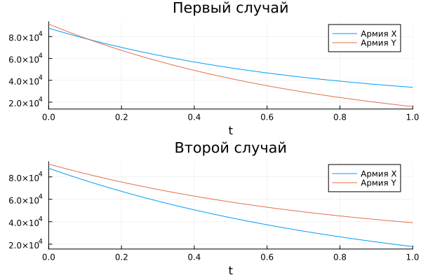

---
## Front matter
title: "Презентация по лабораторной работе №3"
subtitle: "НКНбд-01-21"
author: "Акондзо Жордани Лади Гаэл"

## Generic otions
lang: ru-RU

## Formatting
toc: false
slide_level: 2
theme: metropolis
header-includes: 
 - \metroset{progressbar=frametitle,sectionpage=progressbar,numbering=fraction}
 - '\makeatletter'
 - '\beamer@ignorenonframefalse'
 - '\makeatother'
aspectratio: 43
section-titles: true
---

# Введение

## Введение

- Во время выполнения лабораторной работы мы рассмотрим простейшую модель боевых действий - модель Ланчестера

## Задание ч.1

Между страной Х и страной У идет война. Численность состава войск
исчисляется от начала войны, и являются временными функциями x(t) и y(t). В начальный момент времени страна Х имеет армию численностью 22 022 человек, а в распоряжении страны У армия численностью в 33 033 человек. Для  упрощения модели считаем, что коэффициенты a, b, c, h постоянны. Также считаем P(t) и Q(t) непрерывные функции.

Постройте графики изменения численности войск армии Х и армии У для следующих случаев:

## Задание ч.2

1. Модель боевых действий между регулярными войсками
$\left\{ \begin{array}{cl}
 \frac{dx}{dt} = -0,354x(t) -0,765y(t) + sin(t + 10)\\
 \frac{dy}{dt} = -0,679x(t) - 0,845y(t) + cos(t + 15)
\end{array} \right.$
2. Модель ведение боевых действий с участием регулярных войск и партизанских отрядов
$\left\{ \begin{array}{cl}
 \frac{dx}{dt} = -0,505x(t) -0.77y(t) + sin(2t) + 2\\
 \frac{dy}{dt} = -0.6x(t)y(t) - 0.404y(t) + cos(5t) + 2
\end{array} \right.$

# Ход работы

## Ход работы

1. Установили дополнительный пакет на Julia под названием DifferentialEquations

2. Прописали начальные данные варианта

3. Прописали функции: P(t), Q(t) и сами функции F(x,y,t)

4. Решили, используя Plots.

# Результаты работы

## Модель боевых действий

# Вывод
