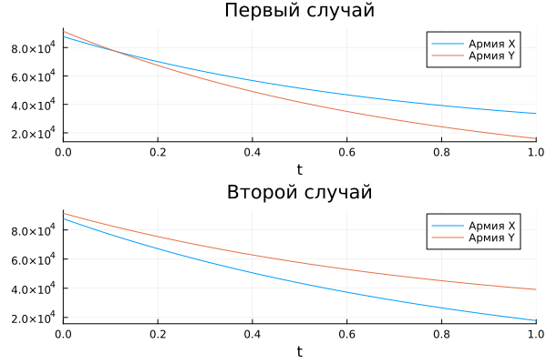

---
## Front matter
title: "Отчёт по лабораторной работе 3"
subtitle: "Простейший вариант 54"
author: "Акондзо Жордани Лади Гаэл"

## Generic otions
lang: ru-RU
toc-title: "Содержание"

## Bibliography
bibliography: bib/cite.bib
csl: pandoc/csl/gost-r-7-0-5-2008-numeric.csl

## Pdf output format
toc: true # Table of contents
toc-depth: 2
lof: true # List of figures
lot: true # List of tables
fontsize: 12pt
linestretch: 1.5
papersize: a4
documentclass: scrreprt
## I18n polyglossia
polyglossia-lang:
  name: russian
  options:
	- spelling=modern
	- babelshorthands=true
polyglossia-otherlangs:
  name: english
## I18n babel
babel-lang: russian
babel-otherlangs: english
## Fonts
mainfont: PT Serif
romanfont: PT Serif
sansfont: PT Sans
monofont: PT Mono
mainfontoptions: Ligatures=TeX
romanfontoptions: Ligatures=TeX
sansfontoptions: Ligatures=TeX,Scale=MatchLowercase
monofontoptions: Scale=MatchLowercase,Scale=0.9
## Biblatex
biblatex: true
biblio-style: "gost-numeric"
biblatexoptions:
  - parentracker=true
  - backend=biber
  - hyperref=auto
  - language=auto
  - autolang=other*
  - citestyle=gost-numeric
## Pandoc-crossref LaTeX customization
figureTitle: "Рис."
tableTitle: "Таблица"
listingTitle: "Листинг"
lofTitle: "Список иллюстраций"
lotTitle: "Список таблиц"
lolTitle: "Листинги"
## Misc options
indent: true
header-includes:
  - \usepackage{indentfirst}
  - \usepackage{float} # keep figures where there are in the text
  - \floatplacement{figure}{H} # keep figures where there are in the text
---

# Цель работы

Научиться работать с Julia и Openmodelica. Рассмотреть простейшую модель боевых действий – модель Ланчестера. Научиться строить графики для данной модели.

# Задание

Формула определения номера задания: (SnmodN)+1, где Sn — номер студбилета, N — количество заданий.

Вариант 54 

Между страной Х и страной У идет война. Численность состава войск исчисляется от начала войны, и являются временными функциями x(t) и y(t). В начальный момент времени страна Х имеет армию численностью 87 700 человек, а в распоряжении страны У армия численностью в 91 400 человек. Для упрощения модели считаем, что коэффициенты a,b,c,h постоянны. Также считаем  P(t) и Q(t) непрерывные функции. Постройте графики изменения численности войск армии Х и армии У для следующих случаев: 

1. Модель боевых действий между регулярными войсками :
dx/dt = -0,354x(t)-0,765y(t) + |sin(t + 10)|

dy/dt = -0,679x(t)-0,845y(t)+|cos(t + 15)| 

2. Модель ведение боевых действий с участием регулярных войск и партизанских отрядов 

dx/dt = -0,505x(t)-0,77y(t)+sin(2t)+2;

dy/dt = -0,6x(t)y(t)-0,404y(t)cos(5t)+2; 

# Теоретическое введение

1. Решение

Рассмотри три случая ведения боевых действий:

Боевые действия между регулярными войсками

Боевые действия с участием регулярных войск и партизанских отрядов

Боевые действия между партизанскими отрядами

В первом случае численность регулярных войск определяется тремя факторами:

скорость уменьшения численности войск из-за причин, не связанных с боевыми действиями (болезни, травмы, дезертирство);

скорость потерь, обусловленных боевыми действиями противоборствующих сторон (что связанно с качеством стратегии, уровнем вооружения, профессионализмом солдат и т.п.);

скорость поступления подкрепления (задаётся некоторой функцией от времени).

В этом случае модель боевых действий между регулярными войсками описывается следующим образом $$ dx/dt = -a(t)x(t)-b(t)y(t)+P(t); dy/dt = -c(t)x(t)-h(t)y(t)+Q(t) $$

Потери, не связанные с боевыми действиями, описывают члены -a(t)x(t) и -h(t)y(t) , члены -b(t)y(t) и -c(t)x(t) отражают потери на поле боя. Коэффициенты b(t) и c(t) указывают на эффективность боевых действий со стороны у и х соответственно, a(t), h(t) - величины, характеризующие степень влияния различных факторов на потери. Функции P(t), Q(t) учитывают возможность подхода подкрепления к войскам Х и У в течение одного дня.

Во втором случае в борьбу добавляются партизанские отряды. Нерегулярные войска в отличии от постоянной армии менее уязвимы, так как действуют скрытно, в этом случае сопернику приходится действовать неизбирательно, по площадям, занимаемым партизанами. Поэтому считается, что тем потерь партизан, проводящих свои операции в разных местах на некоторой известной территории, пропорционален не только численности армейских соединений, но и численности самих партизан. В результате модель принимает вид (в этой системе все величины имею тот же смысл): $$ dx/dt = -a(t)x(t)-b(t)y(t)+P(t); dy/dt = -c(t)x(t)y(t)-h(t)y(t)+Q(t) $$


# Выполнение лабораторной работы

# код

```

using Plots
using DifferentialEquations

# Начальные условия и параметры для первого случая
x0 = 87700  # Начальное количество войск страны X
y0 = 91400  # Начальное количество войск страны Y
a1 = 0.354  # Коэффициент a для первого случая
b1 = 0.765  # Коэффициент b для первого случая
c1 = 0.679  # Коэффициент c для первого случая
h1 = 0.845  # Коэффициент h для первого случая

P1(t) = sin(t + 10)  # Функция P для первого случая
Q1(t) = cos(t + 15)  # Функция Q для первого случая

# Параметры для второго случая
a2 = 0.505  # Коэффициент a для второго случая
b2 = 0.77   # Коэффициент b для второго случая
c2 = 0.6    # Коэффициент c для второго случая
h2 = 0.404  # Коэффициент h для второго случая

# Функции P и Q для второго случая
P2(t) = sin(2 * t) + 2  # Функция P для второго случая
Q2(t) = cos(5 * t) + 2  # Функция Q для второго случая

u0 = [x0, y0]  # Вектор начальных условий
tspan = (0.0, 30.0)  # Интервал времени для моделирования

# Функция для первого случая боевых действий
function combat_regular!(du, u, p, t)
    du[1] = -a1 * u[1] - b1 * u[2] + P1(t)
    du[2] = -c1 * u[1] - h1 * u[2] + Q1(t)
end

# Функция для второго случая с учетом партизанских отрядов
function combat_irregular!(du, u, p, t)
    du[1] = -a2 * u[1] - b2 * u[2] + P2(t)
    du[2] = -c2 * u[1] - h2 * u[2] + Q2(t)
end

# Решение задачи для первого случая
prob1 = ODEProblem(combat_regular!, u0, tspan)
sol1 = solve(prob1, saveat=t)

# Решение задачи для второго случая
prob2 = ODEProblem(combat_irregular!, u0, tspan)
sol2 = solve(prob2, saveat=t)

# Графики решений для обоих случаев
p1 = plot(sol1, label=["Армия X" "Армия Y"], title="Первый случай")
p2 = plot(sol2, label=["Армия X" "Армия Y"], title="Второй случай")

# Отображение графиков в одном окне
plot(p1, p2, layout=(2, 1))

# Сохранение графиков в файл
savefig("scenarios.png")

```




# Выводы

В ходе выполнения лабораторной работы я освоила OpenModelica, рассмотрела простейшую модель боевых действий – модель Ланчестера, научилась строить графики для данной модели.

# Список литературы{.unnumbered}

::: {#refs}

https://docs.julialang.org/en/v1/

https://openmodelica.org/
:::
