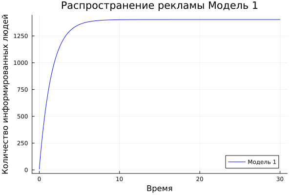

---
## Front matter
lang: ru-RU
title: Презентация к лабораторной работе  7
subtitle: Простейший шаблон
author:
  - Акондзо Жордани Лади Гаэл.
institute:
  - Российский университет дружбы народов, Москва, Россия
  - Факультет физико-математических и естественных наук, Москва, Россия
date: 23 март 2024

## i18n babel
babel-lang: russian
babel-otherlangs: english

## Formatting pdf
toc: false
toc-title: Содержание
slide_level: 2
aspectratio: 169
section-titles: true
theme: metropolis
header-includes:
 - \metroset{progressbar=frametitle,sectionpage=progressbar,numbering=fraction}
 - '\makeatletter'
 - '\beamer@ignorenonframefalse'
 - '\makeatother'
---

# Информация : 

## Докладчик :

  * Акондзо Жордани Лади Гаэл
  * Студент 3-го курса
  * Группа НКНбд-01-21
  * Российский университет дружбы народов
  * 1032215649
  * <https://github.com/Jordaniakondzo>

# Вводная часть :

## Актуальность :

Предположим, что торговыми учреждениями реализуется некоторая продукция, о которой в момент времени t из числа потенциальных покупателей N знает лишь n покупателей. Для ускорения сбыта продукции запускается реклама по радио, телевидению и других средств массовой информации. После запуска рекламной кампании информация о продукции начнет распространяться среди потенциальных покупателей путем общения друг с другом. Таким образом, после запуска рекламных объявлений скорость изменения числа знающих о продукции людей пропорциональна как числу знающих о товаре покупателей, так и числу покупателей о нем не знающих.

## Цели :

- Научиться работать с Julia

- Построение решения распространения информации о товаре, учитывая вклад платной рекламы

- Построение решения распространения информации о товаре, учитывая вклад «сарафанного радио»

- Построение решения распространения информации о товаре, учитывая вклад платной рекламы и «сарафанного радио»

- Научиться определять в какой момент времени скорость распространения рекламы будет иметь максимальное значение

## Задачи :

Постройте график распространения рекламы, математическая модель которой описывается следующим уравнением: 
$$ \frac{\partial n}{\partial t}=(0.64+0.00004n(t))(N-n(t)) $$
$$ \frac{\partial n}{\partial t}=(0.00007+0.7n(t))(N-n(t)) $$
$$ \frac{\partial n}{\partial t}=(0.4t+0.3sin(2t)n(t))(N-n(t)) $$

При этом объем аудитории N=1403 , в начальный момент о товаре знает 9 человек. Для случая 2 определите в какой момент времени скорость распространения рекламы будет иметь максимальное значение.

## Содержание исследования :

- Познакомиться с простейшей моделью эффективности рекламы

- Научиться строить графики распространения рекламы с помощью Julia и OpenModelica

- Применение полученных знаний на практике в дальнейшем

## Полученные график :

1) Случай №1 где $$ \frac{\partial n}{\partial t}=(0.64+0.00004n(t))(N-n(t)) $$

2) Случай №2 где $$ \frac{\partial n}{\partial t}=(0.00007+0.7n(t))(N-n(t)) $$
 

3) Случай №3 где $$ \frac{\partial n}{\partial t}=(0.4t+0.3sin(2t)n(t))(N-n(t)) $$

## Результаты :

- Мы научились работать в Julia

- Научились строить графики распространения рекламы

- Научились определять в какой момент времени скорость распространения рекламы будет иметь максимальное значение

## Итоговый слайд :

- *СПАСИБО ЗА ВИНИМАНИЕ*
