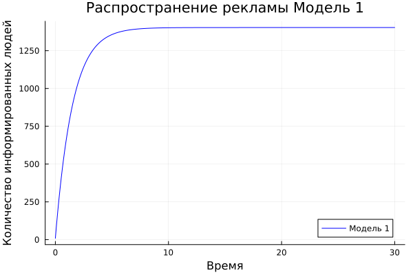
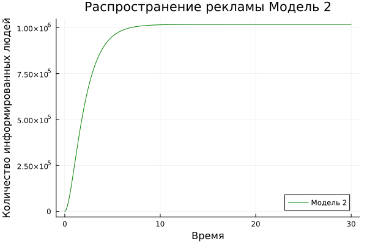
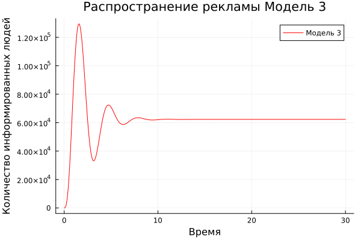
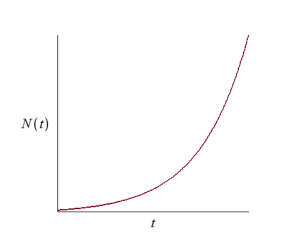
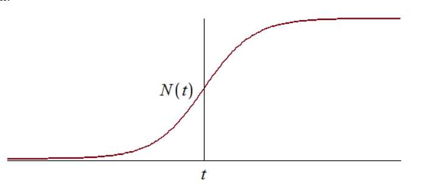

---
## Front matter
title: "Отчёт по лабораторной работе 7"
subtitle: "Простейший вариант 54"
author: "Акондзо Жордани Лади Гаэл"

## Generic otions
lang: ru-RU
toc-title: "Содержание"

## Bibliography
bibliography: bib/cite.bib
csl: pandoc/csl/gost-r-7-0-5-2008-numeric.csl

## Pdf output format
toc: true # Table of contents
toc-depth: 2
lof: true # List of figures
lot: true # List of tables
fontsize: 12pt
linestretch: 1.5
papersize: a4
documentclass: scrreprt
## I18n polyglossia
polyglossia-lang:
  name: russian
  options:
	- spelling=modern
	- babelshorthands=true
polyglossia-otherlangs:
  name: english
## I18n babel
babel-lang: russian
babel-otherlangs: english
## Fonts
mainfont: PT Serif
romanfont: PT Serif
sansfont: PT Sans
monofont: PT Mono
mainfontoptions: Ligatures=TeX
romanfontoptions: Ligatures=TeX
sansfontoptions: Ligatures=TeX,Scale=MatchLowercase
monofontoptions: Scale=MatchLowercase,Scale=0.9
## Biblatex
biblatex: true
biblio-style: "gost-numeric"
biblatexoptions:
  - parentracker=true
  - backend=biber
  - hyperref=auto
  - language=auto
  - autolang=other*
  - citestyle=gost-numeric
## Pandoc-crossref LaTeX customization
figureTitle: "Рис."
tableTitle: "Таблица"
listingTitle: "Листинг"
lofTitle: "Список иллюстраций"
lotTitle: "Список таблиц"
lolTitle: "Листинги"
## Misc options
indent: true
header-includes:
  - \usepackage{indentfirst}
  - \usepackage{float} # keep figures where there are in the text
  - \floatplacement{figure}{H} # keep figures where there are in the text
---

# Цель работы
Построить графики распространения рекламы, определить в какой момент времени скорость распространения рекламы будет иметь максимальное значение.

# Теоретическая справка
Организуется рекламная кампания нового товара или услуги. Необходимо, чтобы прибыль будущих продаж с избытком покрывала издержки на рекламу. Вначале расходы могут превышать прибыль, поскольку лишь малая часть потенциальных покупателей будет информирована о новинке. Затем, при увеличении числа продаж, возрастает и прибыль, и, наконец, наступит момент, когда рынок насытиться, и рекламировать товар станет бесполезным.

Предположим, что торговыми учреждениями реализуется некоторая продукция, о которой в момент времени t из числа потенциальных покупателей N знает лишь n покупателей. Для ускорения сбыта продукции запускается реклама по радио, телевидению и других средств массовой информации. После запуска рекламной кампании информация о продукции начнет распространяться среди потенциальных покупателей путем общения друг с другом. Таким образом, после запуска рекламных объявлений скорость изменения числа знающих о продукции людей пропорциональна как числу знающих о товаре покупателей, так и числу покупателей о нем незнающих.

Модель рекламной кампании описывается следующими величинами. Считаем, что dn/dt - скорость изменения со временем числа потребителей, узнавших о товаре и готовых его купить, t - время, прошедшее с начала рекламной кампании, n(t) - число уже информированных клиентов. Эта величина пропорциональна числу покупателей, еще не знающих о нем, это описывается следующим образом: $$ \alpha_1(t)(N-n(t)) $$ где N - общее число потенциальных платежеспособных покупателей, $$ \alpha_1(t)>0 $$ характеризует интенсивность рекламной кампании (зависит от затрат на рекламу в данный момент времени). Помимо этого, узнавшие о товаре потребители также распространяют полученную информацию среди потенциальных покупателей, не знающих о нем (в этом случае работает т.н. сарафанное радио). Этот вклад в рекламу описывается величиной $$ \alpha_2(t)n(t)(N-n(t)) $$ эта величина увеличивается с увеличением потребителей узнавших о товаре. Математическая модель распространения рекламы описывается уравнением: $$ \frac{\partial n}{\partial t}=(\alpha_1(t)+\alpha_2(t)n(t))(N-n(t)) $$

# Задание

Формула определения номера задания: (SnmodN)+1, где Sn — номер студбилета, N — количество заданий.

Вариант 54

Постройте график распространения рекламы, математическая модель которой описывается следующим уравнением: 
$$ \frac{\partial n}{\partial t}=(0.64+0.00004n(t))(N-n(t)) $$
$$ \frac{\partial n}{\partial t}=(0.00007+0.7n(t))(N-n(t)) $$
$$ \frac{\partial n}{\partial t}=(0.4t+0.3sin(2t)n(t))(N-n(t)) $$

При этом объем аудитории N=1403 , в начальный момент о товаре знает 9 человек. Для случая 2 определите в какой момент времени скорость распространения рекламы будет иметь максимальное значение.


# Выполнение лабораторной работы
## Код для отображения полного графика

```
using Plots
using DifferentialEquations

# Коэффициенты для первого уравнения
a1 = 0.64
a2 = 0.00004

# Коэффициенты для второго уравнения
b1 = 0.00007
b2 = 0.7

# Коэффициенты для третьего уравнения
c1 = 0.4
c2 = 0.3
N = 1403    # Общее количество людей в популяции
n0 = 9      # Начальное количество осведомленных людей

# Определение функции модели ОДУ
function odn_f(du, u, p, t)
    du[1] = (a1 + a2*u[1]) * (N - u[1])    # Модель 1
    du[2] = (b1 + b2*u[1]) * (N - u[1])    # Модель 2
    du[3] = (c1*t + c2*sin(2t)*u[1]) * (N - u[1]) # Модель 3
end

u0 = [n0, n0, n0]  # Начальные условия для каждой модели
tspan = (0.0, 30.0)  # Интервал времени для симуляции

# Создание и решение проблемы ОДУ
prob = ODEProblem(odn_f, u0, tspan)
sol = solve(prob, dtmax=0.1)

# Извлечение данных из решения
N1 = [u[1] for u in sol.u]  # Результаты для первой модели
N2 = [u[2] for u in sol.u]  # Результаты для второй модели
N3 = [u[3] for u in sol.u]  # Результаты для третьей модели
T = [t for t in sol.t]      # Временные метки

# Построение графиков изменения числа осведомленных людей во времени для каждой модели
plt = plot(layout=(1, 3), dpi=300, legend=:bottomright)
plot!(plt[1], T, N1, title="Модель 1", label="Уравнение 1", color=:blue)
plot!(plt[2], T, N2, title="Модель 2", label="Уравнение 2", color=:green)
plot!(plt[3], T, N3, title="Модель 3", label="Уравнение 3", color=:red)

# Сохранение графика
savefig("advertising_models.png")

```

## Код для отображения графиков каждого случая

- Julia

```
# Проследите решения для каждой модели
p1 = plot(T, N1, label="Модель 1", color=:blue, xlabel="Время", ylabel="Количество информированных людей", title="Распространение рекламы Модель 1")
p2 = plot(T, N2, label="Модель 2", color=:green, xlabel="Время", ylabel="Количество информированных людей", title="Распространение рекламы Модель 2")
p3 = plot(T, N3, label="Модель 3", color=:red, xlabel="Время", ylabel="Количество информированных людей", title="Распространение рекламы Модель 3")

# Показать графики в новом окне
display(p1)
display(p2)
display(p3)

# Сохранение графиков в файлы
savefig(p1, "model1.png")
savefig(p2, "model2.png")
savefig(p3, "model3.png")

```
* Для случая 2 определите в какой момент времени скорость распространения рекламы будет иметь максимальное значение:

Чтобы рассчитать, когда скорость распространения рекламы достигнет максимума для случая 2, мы делаем в Julia следующее:
1. Мы используем решение «модели2», полученное путем моделирования.
2. Мы вычисляем производную n(t) по времени, которая представляет скорость распространения рекламы.
3. Выявляем пик этой скорости, то есть момент, когда производная достигает максимального значения.

Вот код, который мы можем связать с общим кодом нашей программы : 

```
# Функция для расчета производной модели 2
function derivative_model2(n, t, b1, b2, N)
    # Вычисление скорости распространения рекламы в момент времени t
    return (b1 + b2*n)*(N - n)
end

# Вычисление скорости распространения для каждого момента времени в решении модели 2
speeds = [derivative_model2(sol1.u[i][2], sol1.t[i], b1, b2, N) for i in 1:length(sol1.t)]

# Поиск индекса максимальной скорости распространения
max_speed_index = argmax(speeds)

# Время, соответствующее максимальной скорости распространения
max_speed_time = sol1.t[max_speed_index]

println("Время, когда скорость распространения рекламы максимальна, t = $max_speed_time")

```

*Время, когда скорость распространения рекламы максимальна, t = 0.019424764212438814*

- `Вот графики для каждого случая :`

1) Случай №1 где $$ \frac{\partial n}{\partial t}=(0.64+0.00004n(t))(N-n(t)) $$ (рис. [-@fig:001]).

{#fig:001 width=70%}


2) Случай №2 где $$ \frac{\partial n}{\partial t}=(0.00007+0.7n(t))(N-n(t)) $$ (рис. [-@fig:002]).
 
{#fig:002 width=70%}

3) Случай №3 где $$ \frac{\partial n}{\partial t}=(0.4t+0.3sin(2t)n(t))(N-n(t)) $$ (рис. [-@fig:003]).

{#fig:003 width=70%}

# Вопросы к лабораторной работе : 

1. Модель Мальтуса (дать пояснение, где используется данная модель). $$ \frac{\partial N}{\partial t}=rN $$ где N — исходная численность населения, r — коэффициент пропорциональности, для которого r = b - d (b — коэффициент рождаемости, d — коэффициент смертности), t — время.

Модель используется в экологии для расчета изменения популяции особей животных.

2. Уравнение логистической кривой (дать пояснение, что описывает данное уравнение). $$ \frac{\partial P}{\partial t}=rP(1-\frac{P}{K}) $$ где r — характеризует скорость роста (размножения), K — поддерживающая ёмкость среды (то есть, максимально возможная численность популяции).

Исходные предположения для вывода уравнения при рассмотрении популяционной динамики выглядят следующим образом:

скорость размножения популяции пропорциональна её текущей численности, при прочих равных условиях;

скорость размножения популяции пропорциональна количеству доступных ресурсов, при прочих равных условиях. Таким образом, второй член уравнения отражает конкуренцию за ресурсы, которая ограничивает рост популяции.

3. В модели распространения рекламы. $$ \alpha_1(t) $$ — интенсивность рекламной кампании, зависящая от затрат. $$ \alpha_2(t) $$ — интенсивность рекламной кампании, зависящая от сарафанного радио.

4. Как ведет себя рассматриваемая модель при $$ \alpha_1(t)>>\alpha_2(t) $$ При данный условиях получается модель типа модели Мальтуса, решение которой имеет вид (рис.4):



5. Как ведет себя рассматриваемая модель при $$ \alpha_1(t)<<\alpha_2(t) $$ При данных условиях получаем уравнение логистической кривой (рис.5):


# Выводы
В ходе выполнения лабораторной работы я научилась строить графики распространения рекламы, определять в какой момент времени скорость распространения рекламы будет иметь максимальное значение.

# Список литературы

Кулябов Д. С. Лабораторная работа №7:
https://esystem.rudn.ru/pluginfile.php/1971582/mod_resource/content/2/%D0%9B%D0%B0%D0%B1%D0%BE%D1%80%D0%B0%D1%82%D0%BE%D1%80%D0%BD%D0%B0%D1%8F%20%D1%80%D0%B0%D0%B1%D0%BE%D1%82%D0%B0%20%E2%84%96%206.pdf

